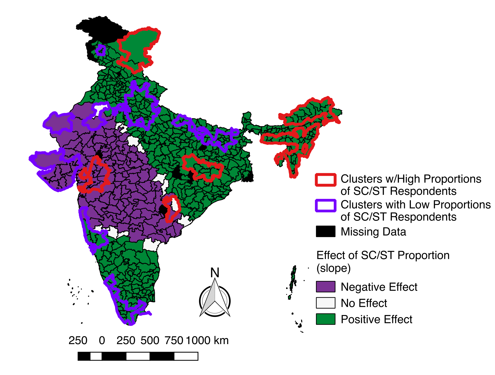

# Caste and Health in India

The exposure image file depicts the distribution of scheduled castes and tribes across India (based on the data from the National Family Health Survey). Statistically significant clustering is also included of areas with high and low proportions of scheduled castes and tribes. The map and data are at district levels.

The model1 file depicts the results of a geographically weighted regression model: TB as an outcome of multiple predictors, including caste. Districts which have a positive association with proportion of scheduled castes/tribes and TB prevalence are depicted as green while districts which have a negative association with proportion of scheduled castes/tribes and TB prevalence are depicted as blue.

