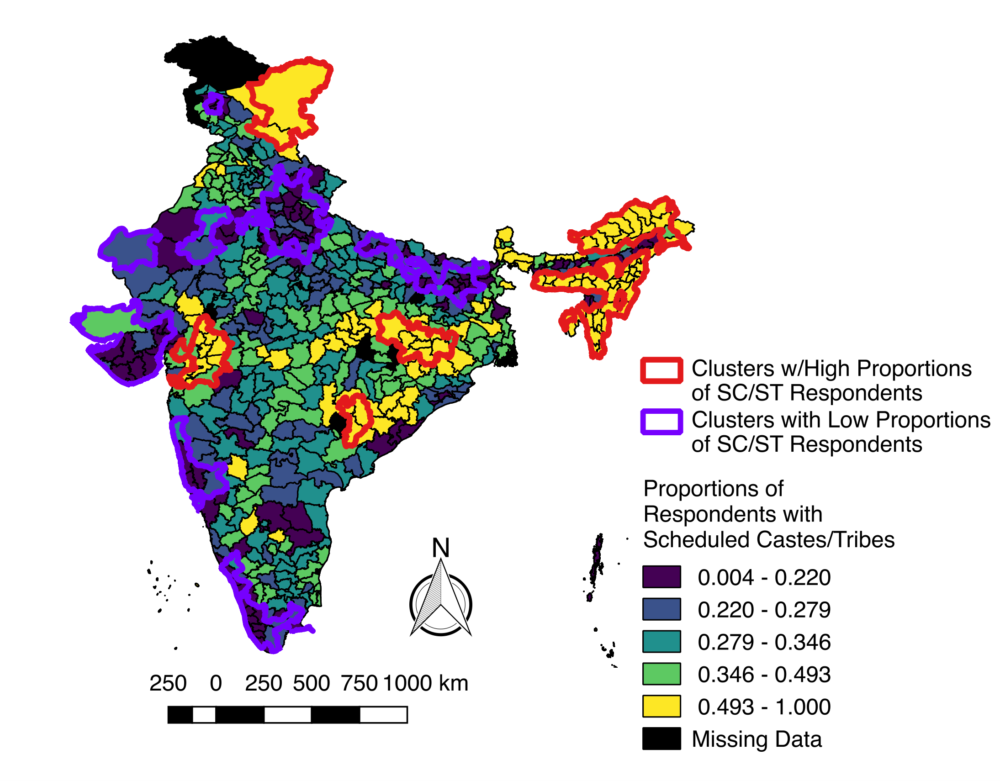

# Caste and Health in India

## TABLE OF CONTENTS

[Background](#BACKGROUND)

[Methods](#METHODS)

[Visualizations](#VISUALIZATIONS)

[Conclusion](#CONCLUSION)

## BACKGROUND:
As the second-most populous nation in the world, India has made significant strides in both economic growth and health care since its establishment in 1947. Poverty rates have decreased due to anti-poverty interventions, and the average life expectancy is currently at approximately 69 years (1). While India is home to some of the best medical centers, such as the Fortis Hospital in Bangalore which has been included in global hospital rankings (2), these institutions are not a complete representation of the Indian healthcare system. A closer look at health indicators reveals a sharp divide in quality indicators along social boundaries. Low-income Indians often receive poor quality healthcare and lack access to more advanced services (3). While cities experience increased economic growth, resulting in improved healthcare services, rural areas lack health care workers and necessary infrastructure (4). Key social determinants result in the heterogeneity of health outcomes of India, with various stakeholders at play.   
 
However, among the health inequities in India, none is so historically-ingrained and replicated as caste. While the caste-system was abolished and caste-based discrimination criminalized, it continues to impact health with regards to social mobility and opportunities (5). Even today, women in an “untouchable” caste have a lower life expectancy and reduced healthcare access compared to their upper-caste counterparts (6,7). While both caste and race are socially ascribed dimensions used to stratify individuals, caste, unlike race, is generationally inherited (8). In this project, I sought to determine whether caste was a significant predictor of three health outcomes: TB, anemia, and health-insured status, when controlling for age and wealth index and accounting for spatial factors.

### Definition of Caste

B. R. Ambedkar, an Indian politician who combatted caste-based discrimination, invokes several definitions of caste in an essay titled Castes in India (9). In addition to acknowledging caste as a closed social unit, he identifies endogamy as the key trait in defining caste. Caste, unlike race, is specific to a respective society and viewed as a whole unit (i.e. an individual cannot be “half” of a caste) (10). However, both caste and race have been associated with health disparities (11,12). For the purposes of this paper, the three-tiered framework on how racism influences health will be applied to casteism’s effect on health as well: institutional, interpersonal, and internalized casteism (13).  

Academics have used caste as a proxy for socioeconomic status rather than designating it separately (14)(15). However, this is flawed for two reasons. First, health disparities on the basis of caste are still prevalent, even when accounting for socioeconomic status, thus indicating they are not synonymous (16,17). Second, this does not account for a history of oppression and generational transfer of wealth which the caste system continues to perpetuate. Caste directly modifies socioeconomic status and therefore must be accounted for in health interventions.

### Caste in India:
The caste system in India is a hierarchy that has been active for centuries. According to the ancient Hindu texts, there are four overarching caste categories: Brahmins (priests), Vaishyas (traders), Kshatriyas (soldiers), and Shudras (servants) (18). Those not classified in any of those options are considered the “Untouchables”, i.e. the outcastes or Dalits. This power imbalance introduced caste-based discrimination. Parallel to Jim Crow laws in the United States, Dalits were prohibited from entering temples, criminalized for eating beef, and forced to use separate facilities (18). In addition to institutional oppression, Dalits experienced interpersonal discrimination. While the caste system does have an origin in the Hindu faith, caste-based discrimination was also practiced among Christians and Muslims living in India (18). In his undelivered speech, Annihilation of Caste, B. R. Ambedkar argued that caste integration would not sufficiently address caste-based discrimination (18). Rather the ultimate solution was “to destroy the belief in the sanctity of the shastras” (the shastras are defined by Ambedkar as those who “teach [individuals] this religion of caste”) (18).

When India gained independence in 1947, several pieces of legislation sought to rectify caste-based oppression. The caste system was abolished via the Indian Constitution in 1950 (19). Additionally, the Constitution explicitly defined marginalized castes as “scheduled castes” (20), A reservation policy in the Indian Constitution allows opportunities (ranging from employment to education) to be allocated in percentages for specific castes deemed as “Scheduled Castes”. Additionally, the Scheduled Castes and the Scheduled Tribes (Prevention of Atrocities) Act, which passed in 1989, outlined hate crimes against Dalits in order to protect them from violence. While these policies were well-intentioned, they lacked large-scale impact; a study evaluating the caste reservation system discovered a mere five percentage point increase in employment for Dalits (21). Dalits still experience higher poverty rates, school dropout rates, and discrimination from their higher-caste counterparts (19). Caste is still a significant determinant of employment (22) and socioeconomic status (19). 

### Caste as a Determinant of Health
According to Link and Phelan’s theory of fundamental causes of health (1995), a fundamental cause includes social factors, which may affect access to resources, which in turn influence affect health outcomes (23). Through this framework, caste fits the definition of a fundamental cause, as it directly affects health through material and non-material access. The mechanism through with caste influences health consists of three components: genetics, early environmental exposures, and social mobility toward obtaining resources (5). With regards to genetics, marrying outside of caste was generally frowned upon (19), resulting in genetic similarities within caste. Genome analysis proved that upper-caste groups tended to have more European DNA in comparison with lower-caste groups, which have higher amounts of Asian-originated DNA (24). Furthermore, genetically transmitted diseases have different rates in accordance to caste. For example, sickle-cell disease is more prevalent among scheduled castes, compared to upper castes (25). Additionally, early environmental exposures, such as iodine intake, have been attributed toward caste, along with their outcomes (in this case, goiters) (26). With respect to social mobility, despite the reservation policy on employment and educational opportunities, lower-caste individuals still have a lower access to increased income, though this could be attributed toward social capital as well (27).  This theory aligns with the evidence presented in existing literature, which reveals caste dictates a significant role in multiple health outcomes, such as maternal morbidity (28) and anemia (29) (this will be discussed more extensively). 

### Infant and Child Health Outcomes
Infants and children identifying as scheduled castes face adverse health outcomes. In a study conducted in 2000, along with results from the National Family Health Survey conducted in India during 2015-2016, scheduled castes had a higher incidence of low birth weight (7,30). Additionally, they experience lower vaccination rates for basic immunizations (15,31,32). The mechanism behind this trend has been attributed toward healthcare delivery, as mothers from scheduled castes have reported decreased healthcare access and experiencing discrimination when receiving services (33). Infants of scheduled castes were also breastfed for a shorter period of time and received water as an alternative, increasing the chances of waterborne diseases (34). When this was examined, many women cited issues with lactation as the primary reason in switching from breast milk to commercial weaning products (35). Children from scheduled castes are also at a higher risk of micronutrient deficiencies, such as anemia, which can result in stunting (36,37). This trend was also observed among urban children, who generally have better health outcomes (38). Furthermore, children from scheduled castes experience goiters at higher rates due to iodine deficiency (26,39).  One study attributed this nutritional disparity toward a poor socioeconomic environment, which lower-caste individuals are more likely to experience (40). 

### Adult Health Outcomes
Caste also plays a significant role in several health outcomes in the adult stage of the life course. Members from scheduled castes are more likely to use biomass as a fuel for cooking, which results in respiratory diseases such as tuberculosis (41). Adolescent undernutrition, also a risk factor for TB, is higher among scheduled castes (42). When evaluating a government tuberculosis reduction program, researchers discovered that members from scheduled castes also face higher levels of stigma, resulting in them delaying a sputum test and worsening their prognosis (43). Caste also impacts maternal health outcomes. Women from scheduled castes experience undernutrition, resulting in a lower maternal BMI (44). Mothers from scheduled castes were also less likely to have a birth attendant, tetanus vaccines, and antenatal care in comparison to their upper caste counterparts (45). Upon a closer examination, it was revealed that lower-caste women tend to use untrained birth attendants in order to avoid caste-stigma perpetuated by medically trained birth attendants from upper castes. This could possibly be linked to higher rates of stillbirth among scheduled caste women (46). Women from lower-castes also experience higher rates of intimate partner violence (7,47), which has been linked to several health outcomes such as reproductive disorders and psychological conditions (48). Researchers have attributed caste inequalities to increased rates of IPV (49). Even after controlling for socioeconomic status, members of scheduled tribes face a lower life expectancy compared to their upper caste counterparts (50).

### Institutional Barriers
Structural obstacles need to be considered when evaluating caste’s role in health. In the National Family Health Survey, approximately 70% of Scheduled Caste respondents experienced at least one major issue in accessing health care (7). Members of scheduled castes are more likely to use public health care services in comparison to upper caste individuals, which are generally of lower quality (4,51). The reason behind this could be tangential to healthcare funding in India, which mostly consists of out of pocket expenditures (4). Given that many scheduled castes live in poverty, this would inevitably result in lower-quality health services (52). This is further supported by the narratives of Dalits, who cited poverty as a reason for lack of biomedical care (53). Another obstacle cited was distance from health care facilities, in which individuals belonging to scheduled castes were located further from services (7,54). Interpersonal casteism was also prevalent: lower caste women were more likely to experience discrimination (55). 

Systemic barriers are not limited to health care systems. Additional systems that influence health include water and sanitation. In a study comparing villages, Dalit communities had fewer toilets and were forced to defecate in the fields (56). As a result, they had a higher incidence of waterborne diseases due to increased microbial content in their drinking water. 

## METHODS:

For this project, I used the 2015-2016 cohort of the Indian National Family Health Survey Data, obtained from the Demographic and Surveys Health Program. Two datasets were used: household member recoded (individual-level) data and clusters based on latitude and longitude. There were a total of 2,869,043 respondents, 28,526 points, and 640 districts (as of the time of administration of the survey). The study population included members of households in India. The datasets were joined and overall proportions of exposures, co-variates, and outcomes were calculated per number of respondents in each district. The exposure of interest—being a member of a scheduled caste or tribe—was operationalized as dichotomous. 

The shape file containing the districts of India was obtained from GADM, the Database of Global Administrative Areas. Initially, a local Moran’s univariate I test was ran to examine spatial neighbors using Queens’ contiguity (Moran’s I = 0.2035, p-value = 0.001). 

Then a local Moran’s univariate I test was ran on scheduled caste/tribe proportion to identify clusters with high and low proportions of scheduled caste/tribe populations (Moran’s I = 0.63, p-value = 0.001). Afterwards, one global regression model was run per each outcome (proportion of anemic respondents, proportion of respondents with tuberculosis, and proportion of respondents covered by a health scheme), with proportion of scheduled caste/tribe members as the main exposure, while controlling for median age of respondents per district and average wealth index of respondents per district. Then, using the R package spgwr, I ran the localized models via a geographically weighted regression approach with a Gaussian weighting scheme.

## VISUALIZATIONS: 
The exposure image file depicts the distribution of scheduled castes and tribes across India (based on the data from the National Family Health Survey). Statistically significant clustering is also included of areas with high and low proportions of scheduled castes and tribes. The map and data are at district levels.

The model1 file depicts the results of a geographically weighted regression model: TB as an outcome of multiple predictors, including caste. Districts which have a positive association with proportion of scheduled castes/tribes and TB prevalence are depicted as green while districts which have a negative association with proportion of scheduled castes/tribes and TB prevalence are depicted as blue.

## CONCLUSION:
### Discussion:
I hypothesized that based on my knowledge, the scheduled caste coefficient would have a positive effect on both TB and anemia cases, while having a negative correlation with health scheme status. Two of the three global models (health scheme and anemia) did not align with my hypothesis. However, when running local models, some districts did have coefficients in agreement with my hypothesis (which was based on my literature review). This is crucial because India’s health care policies are heterogeneous and dependent on both state and local policies. This could dictate future research in which the impact of local health policies in India on scheduled castes and tribes are evaluated.

### Limitations:
Some limitations of these analyses include the loss of heterogeneity when dichotomizing castes. India contains multiple scheduled castes and tribes, all of which have experienced different forms of oppression. Disaggregating caste as a category in future health surveys could provide deeper insight into the various needs of scheduled caste/tribe communities. Additionally, this model was based on aggregate values (i.e. the median age) rather than using a clustered, multilevel analysis. Weights provided in the dataset were not used, so we also do not have assurance of external validity. 

### Future Research:
Future studies should disaggregate data, include population density as a variable, and consider local health policies and programs when considering the impact of caste on health.
